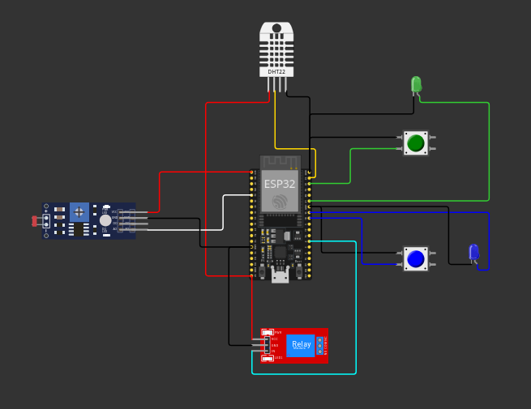

# Sistema de Irrigação Automatizada e Inteligente
### Introdução
Este sistema tem como objetivo otimizar a irrigação de culturas, monitorando em tempo real a umidade do solo, os níveis de nutrientes (fósforo - P e potássio - K) e o pH. Através de sensores e atuadores, o sistema ajusta automaticamente a quantidade de água aplicada, garantindo o crescimento saudável das plantas.

Nota: Os comportamentos de hardware dos sensores e os valores de entrada são gerados por um simulador no Wokwi e inseridos manualmente no sistema para análise e atuação.

## Base de Dados 
 **Tabelas:**
  * **culturas:** Armazena informações sobre as diferentes culturas, como nome, níveis ideais de nutrientes e umidade.
  * **sensores:** Guarda detalhes sobre os sensores utilizados, como tipo, descrição e localização.
  * **leituras:** Registra as medições realizadas pelos sensores em um determinado momento para uma cultura específica.
  * **irrigacoes:** Controla as ações de irrigação, como tempo, motivo e data.
## Funcionamento
1. **Coleta de Dados:**
   * **Sensores:**
     * **Umidade:** Sensor de umidade do solo mede o nível de água no solo.
     * **Nutrientes (P e K):** Botões simulam a presença ou ausência dos nutrientes.
     * **pH:** Sensor LDR mede a intensidade da luz refletida por uma solução, indicando o pH.
   * **Leitura:** Os dados coletados pelos sensores são armazenados na tabela `leituras`.

2. **Análise dos Dados:**
   * O sistema compara os dados coletados com os valores ideais definidos para cultura informada.
   * **Regra de Irrigação:** Se a umidade estiver abaixo do ideal ou se os níveis de nutrientes estiverem baixos, o sistema ativa a bomba d'água (representada por um relé).

3. **Atuação:**
   * **Bomba d'água:** A bomba é acionada por um determinado período, ajustando a quantidade de água aplicada.

4. **Registro:**
   * Toda vez que um novo registro de leitura é criado na tabela leituras, o sistema gera automaticamente um registro na tabela irrigacoes atrelado à leitura recém-criada. Isso assegura que cada medição relevante tenha uma resposta automatizada registrada no sistema.

## Operações CRUD

* **Sensores:**
  * **Criar:** Adicionar um novo sensor ao sistema.
  * **Listar:** Exibir todos os sensores cadastrados.
  * **Atualizar:** Modificar as informações de um sensor existente.
  * **Deletar:** Remover um sensor do sistema.

* **Culturas:**
  * **Criar:** Cadastrar uma nova cultura com seus respectivos níveis ideais.
  * **Listar:** Exibir todas as culturas cadastradas.
  * **Atualizar:** Modificar as informações de uma cultura existente.
  * **Deletar:** Remover uma cultura do sistema.

* **Irrigação:**
    * **Criar:** Cria uma nova irrigacao de forma automatizada, sempre que uma leitura é registrada
  * **Listar:** Exibir o histórico de irrigações.
  * **Deletar:** Remover uma irrigação do histórico (para fins de limpeza de dados).

  ##  imagens do circuito da plataforma Wokwi.com as conexões dos sensores solicitados

  

  ## link video youtube
    link do vídeo postado no Youtube (sem listagem), demonstrando o funcionamento completo do projeto
  **link:**
    https://youtu.be/WCAkkt9Af1c
